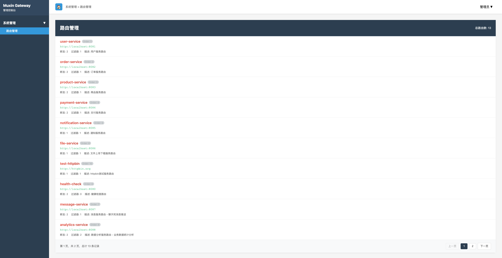

# Muxin Gateway

[](https://www.apache.org/licenses/LICENSE-2.0)
[](https://adoptopenjdk.net/)
[](https://spring.io/projects/spring-boot)
[](https://netty.io/)

Muxin Gateway 是一个基于 Netty 和 Spring Boot 的高性能 API 网关，提供路由转发、负载均衡、服务发现、管理界面等核心功能。设计简洁、性能卓越、易于扩展。

## ✨ 核心特性

### 已实现功能
- 🚀 **高性能**: 基于 Netty 异步非阻塞 I/O，支持高并发
- 🔀 **智能路由**: 支持路径、方法等多种路由条件匹配
- ⚖️ **负载均衡**: 内置轮询负载均衡算法
- 🔍 **服务发现**: 集成 Nacos 服务注册与发现
- 🎛️ **管理界面**: 提供Web管理界面，查看路由配置
- 🔧 **基础配置**: 支持静态路由配置

### 待实现功能 (Roadmap)
- 🔄 **动态路由**: 运行时动态添加、修改路由 *(计划中)*
- 📊 **实时监控**: 路由统计和性能监控 *(计划中)*
- ⚖️ **扩展负载均衡**: 随机、加权轮询等算法 *(计划中)*
- 🚦 **限流控制**: 请求限流和熔断功能 *(计划中)*
- 🔍 **健康检查**: 自动服务健康检查和下线 *(计划中)*

## 🏗️ 项目架构

```
muxin-gateway/
├── gateway-core/           # 核心模块
│   ├── admin/             # 管理界面
│   ├── config/            # 配置管理
│   ├── filter/            # 过滤器链
│   ├── http/              # HTTP处理
│   ├── loadbalance/       # 负载均衡
│   ├── netty/             # Netty服务器
│   ├── route/             # 路由管理
│   └── predicate/         # 路由断言
├── gateway/               # 启动模块
├── gateway-registry/      # 注册中心
│   ├── api/              # 注册中心API
│   └── nacos-impl/       # Nacos实现
└── docs/                 # 文档
```

## 🚀 快速开始

### 环境要求

- JDK 17+
- Maven 3.6+
- Nacos 2.0+ (可选)

### 1. 克隆项目

```bash
git clone https://github.com/your-username/muxin-gateway.git
cd muxin-gateway
```

### 2. 编译项目

```bash
./mvnw clean package -DskipTests
```

### 3. 启动网关

```bash
java -jar gateway/target/gateway-1.0-SNAPSHOT.jar
```

### 4. 访问管理界面

打开浏览器访问: `http://localhost:8080/admin`

默认账号: `admin` / `admin123`

## 📋 配置说明

### 基础配置

```yaml
muxin:
  gateway:
    # Netty服务器配置
    netty:
      server:
        port: 8080
        event-loop-group-boss-num: 1
        event-loop-group-worker-num: 4
    
    # 注册中心配置
    register:
      type: nacos
      address: localhost:8848
      username: nacos
      password: nacos
    
    # 管理界面配置
    admin:
      enabled: true
      path-prefix: /admin
      username: admin
      password: admin123
```

### 路由配置

```yaml
muxin:
  gateway:
    routes:
      - id: user-service
        uri: http://localhost:8081
        order: 1
        predicates:
          - name: Path
            args:
              pattern: "/api/user/**"
          - name: Method
            args:
              methods: "GET,POST,PUT,DELETE"
        filters:
          - name: StripPrefix
            args:
              parts: "2"
```

## 🔧 核心功能

### 路由管理

- **路径匹配**: 支持 Ant 风格路径模式 ✅
- **HTTP方法**: 支持指定 HTTP 方法匹配 ✅
- **路由优先级**: 通过 order 字段控制路由优先级 ✅
- **动态配置**: 支持运行时动态添加、修改路由 *(待实现)*

### 过滤器

- **StripPrefix**: 移除路径前缀 ✅
- **LoadBalance**: 负载均衡 ✅
- **HttpProxy**: HTTP代理转发 ✅
- **RequestRateLimit**: 请求限流 *(待实现)*

### 负载均衡

- **轮询 (Round Robin)**: 默认负载均衡策略 ✅
- **随机 (Random)**: 随机选择后端服务 *(待实现)*
- **加权轮询**: 支持服务权重配置 *(待实现)*

### 服务发现

- **Nacos集成**: 自动服务注册与发现 ✅
- **健康检查**: 定期检查服务健康状态 *(待实现)*
- **自动下线**: 不健康服务自动剔除 *(待实现)*

## 🎯 使用示例

### 1. 配置路由

通过配置文件配置路由规则：

```yaml
routes:
  - id: user-api
    uri: http://user-service
    predicates:
      - Path=/api/user/**
    filters:
      - StripPrefix=2
```

### 2. 调用API

```bash
# 原始请求
curl http://localhost:8080/api/user/profile

# 实际转发到
curl http://user-service/profile
```

### 3. 管理界面操作

1. 访问 `http://localhost:8080/admin`
2. 登录管理界面
3. 查看路由列表和配置

## 🤝 贡献指南

欢迎贡献代码！请遵循以下步骤：

1. Fork 项目
2. 创建特性分支 (`git checkout -b feature/AmazingFeature`)
3. 提交更改 (`git commit -m 'Add some AmazingFeature'`)
4. 推送到分支 (`git push origin feature/AmazingFeature`)
5. 创建 Pull Request

## 📄 开源协议

本项目采用 [Apache License 2.0](LICENSE) 开源协议。

## 🙋‍♂️ 支持与反馈

- 📝 [提交Issue](https://github.com/your-username/muxin-gateway/issues)
- 💬 [参与讨论](https://github.com/your-username/muxin-gateway/discussions)
- 📧 邮箱: your-email@example.com

---

⭐ 如果这个项目对你有帮助，请给个星标支持！ 