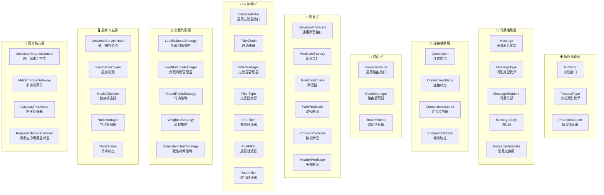

# 协议无关网关架构设计文档

## 📖 文档概述

本文档详细描述了一个协议无关的高性能API网关系统的完整架构设计，包括核心接口定义、系统架构、请求处理流程等内容。该网关系统支持HTTP、TCP、UDP、WebSocket、gRPC、MQTT等多种协议，实现了真正的协议无关性。

## 🎯 设计目标

### 核心理念
- **协议无关性**: 支持任意协议的接入和转发
- **统一抽象**: 所有协议使用统一的消息模型
- **可扩展性**: 插件化的协议适配和处理机制
- **高性能**: 异步非阻塞的处理架构
- **易扩展**: 模块化设计，支持功能扩展

### 技术目标
- 支持10000+ QPS并发处理
- 毫秒级响应延迟
- 99.9%+ 可用性保证
- 支持水平扩展
- 零停机配置更新

## 🏗️ 核心接口设计

### 1. 协议抽象层接口

#### Protocol - 协议接口
```java
/**
 * 协议接口 - 定义协议的基本特征
 */
public interface Protocol {
    String getName();                           // 协议名称
    String getVersion();                        // 协议版本
    ProtocolType getType();                     // 协议类型
    boolean isConnectionOriented();             // 是否面向连接
    boolean isRequestResponseBased();           // 是否支持请求-响应模式
    boolean isStreamingSupported();             // 是否支持流式传输
    int getDefaultPort();                       // 默认端口
    Map<String, Object> getProtocolConfig();   // 协议特定配置
}
```

#### ProtocolType - 协议类型枚举
```java
public enum ProtocolType {
    HTTP,           // HTTP协议 (HTTP/1.1, HTTP/2, HTTP/3)
    TCP,            // 原始TCP协议
    UDP,            // 原始UDP协议
    WEBSOCKET,      // WebSocket协议
    GRPC,           // gRPC协议 (基于HTTP/2)
    MQTT,           // MQTT消息队列协议
    REDIS,          // Redis协议
    MYSQL,          // MySQL协议
    CUSTOM          // 自定义协议
}
```

### 2. 消息抽象层接口

#### Message - 通用消息接口
```java
/**
 * 通用消息接口 - 协议无关的消息抽象
 */
public interface Message {
    String getMessageId();                      // 消息ID
    MessageType getType();                      // 消息类型
    Protocol getProtocol();                     // 协议信息
    MessageHeaders getHeaders();                // 消息头部
    MessageBody getBody();                      // 消息体
    MessageMetadata getMetadata();              // 消息元数据
    Message createResponse();                   // 创建响应消息
    Message copy();                             // 消息克隆
}
```

#### MessageHeaders - 消息头部接口
```java
public interface MessageHeaders {
    void set(String name, Object value);
    <T> T get(String name, Class<T> type);
    <T> Optional<T> getOptional(String name, Class<T> type);
    boolean contains(String name);
    void remove(String name);
    Set<String> getNames();
    Map<String, Object> asMap();
    void setProtocolHeaders(Map<String, Object> headers);
    Map<String, Object> getProtocolHeaders();
}
```

#### MessageBody - 消息体接口
```java
public interface MessageBody {
    byte[] getBytes();                          // 获取原始字节数据
    String getString();                         // 获取字符串内容
    <T> T getContent(Class<T> type);           // 获取结构化内容
    InputStream getInputStream();               // 获取输入流
    boolean isEmpty();                          // 是否为空
    long getContentLength();                    // 内容长度
    String getContentType();                    // 内容类型
    boolean isStreaming();                      // 是否为流式内容
}
```

#### MessageMetadata - 消息元数据接口
```java
public interface MessageMetadata {
    long getTimestamp();                        // 消息时间戳
    long getReceiveTime();                      // 接收时间
    long getSendTime();                         // 发送时间
    EndpointAddress getSourceAddress();         // 来源地址
    EndpointAddress getTargetAddress();         // 目标地址
    String getConnectionId();                   // 连接ID
    String getRouteId();                        // 路由ID
    String getServiceName();                    // 服务名称
    String getTraceId();                        // 追踪ID
    String getSpanId();                         // Span ID
    Map<String, Object> getAttributes();       // 扩展属性
    <T> T getAttribute(String key, Class<T> type);
    void setAttribute(String key, Object value);
}
```

### 3. 连接抽象层接口

#### Connection - 连接接口
```java
/**
 * 连接接口 - 协议无关的连接抽象
 */
public interface Connection {
    String getConnectionId();                   // 连接ID
    Protocol getProtocol();                     // 协议信息
    EndpointAddress getLocalAddress();          // 本地地址
    EndpointAddress getRemoteAddress();         // 远程地址
    ConnectionStatus getStatus();               // 连接状态
    CompletableFuture<Void> send(Message message); // 发送消息
    CompletableFuture<Void> close();            // 关闭连接
    boolean isActive();                         // 是否活跃
    Map<String, Object> getAttributes();       // 连接属性
    void setAttribute(String key, Object value);
    <T> T getAttribute(String key, Class<T> type);
    void addConnectionListener(ConnectionListener listener);
    void removeConnectionListener(ConnectionListener listener);
}
```

#### EndpointAddress - 端点地址接口
```java
public interface EndpointAddress {
    Protocol getProtocol();                     // 协议类型
    String getHost();                           // 主机地址
    int getPort();                              // 端口号
    String getPath();                           // 路径或资源标识
    Map<String, String> getParameters();       // 查询参数
    String toUri();                             // 完整URI
    boolean isValid();                          // 地址是否有效
    Map<String, Object> getProtocolSpecificInfo(); // 协议特定信息
}
```

### 4. 网关核心接口

#### UniversalRequestContext - 通用请求上下文
```java
/**
 * 通用请求上下文 - 协议无关
 */
public interface UniversalRequestContext {
    // 消息信息
    Message getInboundMessage();
    void setInboundMessage(Message message);
    Message getOutboundMessage();
    void setOutboundMessage(Message message);
    
    // 连接信息
    Connection getInboundConnection();
    Connection getOutboundConnection();
    void setOutboundConnection(Connection connection);
    
    // 路由信息
    Object getMatchedRoute();
    void setMatchedRoute(Object route);
    Object getSelectedNode();
    void setSelectedNode(Object node);
    
    // 协议信息
    Protocol getInboundProtocol();
    Protocol getOutboundProtocol();
    boolean needsProtocolConversion();
    
    // 属性管理
    <T> T getAttribute(String key, Class<T> type);
    void setAttribute(String key, Object value);
    Map<String, Object> getAttributes();
    
    // 生命周期
    long getStartTime();
    void markComplete();
    boolean isCompleted();
    
    // 错误处理
    Throwable getError();
    void setError(Throwable error);
    boolean hasError();
}
```

#### ProtocolAdapter - 协议适配器接口
```java
/**
 * 协议适配器 - 将协议特定的请求转换为通用消息
 */
public interface ProtocolAdapter {
    Protocol getSupportedProtocol();
    Message adaptInbound(Object protocolSpecificData, Connection connection);
    Object adaptOutbound(Message message, Connection connection);
    Connection createConnection(EndpointAddress address, Map<String, Object> options);
    boolean validateAddress(EndpointAddress address);
    Map<String, Object> getProtocolConfig();
}
```

#### MultiProtocolGateway - 多协议网关接口
```java
/**
 * 多协议网关接口
 */
public interface MultiProtocolGateway {
    CompletableFuture<Message> handleInbound(Message inboundMessage, Connection inboundConnection);
    Set<Protocol> getSupportedProtocols();
    void registerProtocolAdapter(ProtocolAdapter adapter);
    void startProtocolListener(Protocol protocol, int port, Map<String, Object> config);
    void stopProtocolListener(Protocol protocol);
    Map<Protocol, Object> getProtocolStats();
    void start();
    void stop();
    boolean isRunning();
}
```

## 🏛️ 完整系统架构

### 架构分层图



### 架构特点

#### 🎯 分层解耦设计
- **协议抽象层**: 定义协议特征和适配机制
- **消息抽象层**: 统一的消息表示，协议无关
- **连接抽象层**: 连接生命周期管理
- **路由层**: 请求路由匹配和管理
- **断言层**: 路由匹配条件判断
- **过滤器层**: 请求处理管道
- **负载均衡层**: 流量分发策略
- **服务节点层**: 后端服务管理
- **网关核心层**: 网关核心处理逻辑

#### 🔄 设计模式应用
- **适配器模式**: 协议转换和适配
- **策略模式**: 负载均衡和过滤器策略
- **责任链模式**: 过滤器链和断言链
- **工厂模式**: 组件动态创建
- **观察者模式**: 事件监听和通知

## 🚀 请求处理详细流程

### 请求处理流程图

```mermaid
graph TD
    %% 请求接收阶段
    Start([客户端发起请求]) --> Receive[📥 请求接收器<br/>支持多协议监听]
    Receive --> ProtocolDetect{🔍 协议检测<br/>HTTP/TCP/UDP/gRPC等}
    
    %% 协议适配阶段
    ProtocolDetect -->|HTTP| HttpAdapter[🔌 HTTP协议适配器]
    ProtocolDetect -->|TCP| TcpAdapter[🔌 TCP协议适配器]
    ProtocolDetect -->|gRPC| GrpcAdapter[🔌 gRPC协议适配器]
    ProtocolDetect -->|其他| OtherAdapter[🔌 其他协议适配器]
    
    HttpAdapter --> CreateMessage[📨 创建统一Message对象]
    TcpAdapter --> CreateMessage
    GrpcAdapter --> CreateMessage
    OtherAdapter --> CreateMessage
    
    %% 上下文创建
    CreateMessage --> CreateContext[🎯 创建UniversalRequestContext<br/>- 设置入站消息<br/>- 设置入站连接<br/>- 初始化属性]
    
    %% 全局前置过滤器
    CreateContext --> GlobalPreFilters{🔧 全局前置过滤器链}
    GlobalPreFilters --> AuthFilter[🔐 认证过滤器<br/>JWT/OAuth2/ApiKey]
    AuthFilter --> RateLimitFilter[🚦 限流过滤器<br/>令牌桶/滑动窗口]
    RateLimitFilter --> ValidationFilter[✅参数校验过滤器<br/>请求格式验证]
    
    %% 路由匹配阶段
    ValidationFilter --> RouteMatch{🚦 路由匹配器<br/>查找匹配的路由}
    RouteMatch -->|找到路由| PredicateCheck[⚡ 断言验证<br/>验证所有断言条件]
    RouteMatch -->|未找到| NoRouteError[❌ 404 路由未找到]
    
    %% 断言验证详细流程
    PredicateCheck --> PathPredicate{📍 路径断言<br/>Path=/api/**}
    PathPredicate -->|匹配| MethodPredicate{🔨 方法断言<br/>Method=GET,POST}
    PathPredicate -->|不匹配| PredicateFailure[❌ 断言验证失败]
    
    MethodPredicate -->|匹配| HeaderPredicate{📋 头部断言<br/>Authorization存在}
    MethodPredicate -->|不匹配| PredicateFailure
    
    HeaderPredicate -->|匹配| OtherPredicates{⚡ 其他断言<br/>Query/Cookie/Host等}
    HeaderPredicate -->|不匹配| PredicateFailure
    
    OtherPredicates -->|全部匹配| RouteFilters[🔧 路由级过滤器链]
    OtherPredicates -->|任一不匹配| PredicateFailure
    
    %% 路由级过滤器
    RouteFilters --> ProtocolConvert[🔄 协议转换过滤器<br/>HTTP→gRPC等]
    ProtocolConvert --> RetryFilter[🔁 重试过滤器<br/>指数退避重试]
    RetryFilter --> CircuitBreaker[⚡ 熔断过滤器<br/>快速失败保护]
    
    %% 负载均衡阶段
    CircuitBreaker --> LoadBalance{⚖️ 负载均衡器<br/>选择目标节点}
    LoadBalance --> NodeHealth{🏥 节点健康检查<br/>验证节点可用性}
    NodeHealth -->|健康| SelectNode[🎯 选择服务节点<br/>应用负载均衡策略]
    NodeHealth -->|不健康| NodeUnavailable[❌ 服务不可用]
    
    %% 负载均衡策略分支
    SelectNode --> RoundRobin[🔄 轮询策略]
    SelectNode --> WeightedRR[⚖️ 加权轮询]
    SelectNode --> LeastConn[📊 最少连接]
    SelectNode --> ConsistentHash[🔗 一致性哈希]
    
    RoundRobin --> CreateConnection[🔗 创建后端连接]
    WeightedRR --> CreateConnection
    LeastConn --> CreateConnection
    ConsistentHash --> CreateConnection
    
    %% 后端调用阶段
    CreateConnection --> BackendCall[📤 后端服务调用<br/>发送转换后的请求]
    BackendCall --> BackendResponse{📥 后端响应<br/>等待服务响应}
    
    BackendResponse -->|成功| PostFilters[🔧 后置过滤器链]
    BackendResponse -->|超时| TimeoutError[⏰ 请求超时]
    BackendResponse -->|连接失败| ConnectionError[🔌 连接错误]
    BackendResponse -->|其他错误| BackendError[❌ 后端错误]
    
    %% 后置过滤器链
    PostFilters --> ResponseTransform[🔄 响应转换过滤器<br/>格式转换/数据脱敏]
    ResponseTransform --> LoggingFilter[📝 日志过滤器<br/>记录请求响应日志]
    LoggingFilter --> MetricsFilter[📊 监控过滤器<br/>收集性能指标]
    
    %% 响应返回阶段
    MetricsFilter --> ProtocolAdaptBack[🔌 协议适配返回<br/>转换回原协议格式]
    ProtocolAdaptBack --> SendResponse[📤 发送响应<br/>返回给客户端]
    SendResponse --> End([✅ 请求处理完成])
    
    %% 错误处理流程
    NoRouteError --> ErrorHandler[🚨 错误处理器]
    PredicateFailure --> ErrorHandler
    NodeUnavailable --> ErrorHandler
    TimeoutError --> ErrorHandler
    ConnectionError --> ErrorHandler
    BackendError --> ErrorHandler
    
    ErrorHandler --> ErrorResponse[📝 生成错误响应<br/>统一错误格式]
    ErrorResponse --> ErrorLogging[📝 错误日志记录]
    ErrorLogging --> SendErrorResponse[📤 发送错误响应]
    SendErrorResponse --> End
```



### 详细处理阶段

#### 1️⃣ 请求接收阶段 (Request Reception)
```java
// 多协议监听器启动
MultiProtocolGateway gateway = new MultiProtocolGateway();
gateway.startProtocolListener(HTTP, 8080, httpConfig);
gateway.startProtocolListener(TCP, 9090, tcpConfig);
gateway.startProtocolListener(GRPC, 9091, grpcConfig);
```

**职责**：
- 监听多个端口，支持不同协议
- 检测入站请求的协议类型
- 建立客户端连接

#### 2️⃣ 协议适配阶段 (Protocol Adaptation)
```java
// HTTP适配器示例
public class HttpProtocolAdapter implements ProtocolAdapter {
    public Message adaptInbound(HttpServletRequest request, Connection conn) {
        return Message.builder()
            .messageId(generateId())
            .type(MessageType.REQUEST)
            .protocol(HTTP_PROTOCOL)
            .headers(extractHeaders(request))
            .body(extractBody(request))
            .metadata(createMetadata(request, conn))
            .build();
    }
}
```

**职责**：
- 将协议特定的请求转换为统一的Message对象
- 提取协议无关的请求信息
- 创建统一的请求上下文

#### 3️⃣ 全局前置过滤器阶段 (Global Pre-Filters)
```java
FilterChain preFilterChain = FilterChain.builder()
    .addFilter(new AuthenticationFilter())     // 认证
    .addFilter(new RateLimitFilter())         // 限流
    .addFilter(new ValidationFilter())        // 参数校验
    .build();
```

**常见过滤器**：
- **认证过滤器**: JWT验证、OAuth2、API Key验证
- **限流过滤器**: 基于令牌桶、滑动窗口的流量控制
- **参数校验过滤器**: 请求格式验证、必需参数检查
- **CORS过滤器**: 跨域请求处理

#### 4️⃣ 路由匹配和断言验证阶段 (Route Matching & Predicate Validation)
```java
public class RouteMatcher {
    public Optional<UniversalRoute> match(UniversalRequestContext context) {
        return routeManager.getAllRoutes().stream()
            .filter(route -> route.isEnabled())
            .sorted(Comparator.comparing(UniversalRoute::getOrder))
            .filter(route -> matchesAllPredicates(route, context))
            .findFirst();
    }
}
```

**断言类型**：
- **路径断言**: 匹配请求路径模式
- **方法断言**: 验证HTTP方法或协议操作
- **头部断言**: 检查请求头存在性和值
- **协议断言**: 验证协议类型

#### 5️⃣ 负载均衡阶段 (Load Balancing)
```java
public class WeightedRoundRobinStrategy implements LoadBalanceStrategy {
    public UniversalServiceNode choose(List<UniversalServiceNode> nodes, 
                                      UniversalRequestContext context) {
        List<UniversalServiceNode> healthyNodes = nodes.stream()
            .filter(node -> node.getStatus() == NodeStatus.HEALTHY)
            .collect(toList());
        return selectByWeight(healthyNodes);
    }
}
```

**负载均衡策略**：
- **轮询**: 依次分配请求
- **加权轮询**: 基于节点权重分配
- **最少连接**: 选择连接数最少的节点
- **一致性哈希**: 基于请求特征的哈希路由

#### 6️⃣ 后端服务调用阶段 (Backend Invocation)
```java
public CompletableFuture<Message> invoke(UniversalServiceNode node, 
                                       Message request, 
                                       UniversalRequestContext context) {
    Connection backendConnection = createConnection(node, request.getProtocol());
    return backendConnection.send(request)
        .thenCompose(response -> processResponse(response, context));
}
```

#### 7️⃣ 后置过滤器和响应返回阶段 (Post Filters & Response Return)
```java
FilterChain postFilterChain = FilterChain.builder()
    .addFilter(new ResponseTransformFilter())  // 响应转换
    .addFilter(new DataMaskingFilter())       // 数据脱敏
    .addFilter(new LoggingFilter())           // 日志记录
    .addFilter(new MetricsFilter())           // 指标收集
    .build();
```

## 🎯 应用场景示例

### 场景1：HTTP → gRPC 协议转换
```yaml
# 路由配置
route:
  id: user-service-grpc
  predicates:
    - path: /api/users/**
    - method: POST
  filters:
    - protocol-convert: 
        target: gRPC
        service: UserService
        method: CreateUser
  target:
    protocol: gRPC
    address: user-grpc-service:9090
```

### 场景2：TCP 透明代理
```yaml
# TCP代理配置
route:
  id: tcp-proxy
  predicates:
    - protocol: TCP
    - port: 8080
  filters:
    - connection-pool:
        maxConnections: 100
    - load-balance:
        strategy: round-robin
  targets:
    - tcp://backend1:8080
    - tcp://backend2:8080
```

### 场景3：WebSocket 路由
```yaml
# WebSocket路由配置
route:
  id: websocket-chat
  predicates:
    - protocol: WebSocket
    - path: /chat/**
  filters:
    - session-affinity: true
    - message-broadcast: true
  target:
    protocol: WebSocket
    address: chat-service:9090
```

## 📊 性能优化策略

### 1. 异步非阻塞处理
```java
CompletableFuture<Message> process(UniversalRequestContext context) {
    return applyPreFilters(context)
        .thenCompose(this::matchRoute)
        .thenCompose(this::applyRouteFilters)
        .thenCompose(this::invokeBackend)
        .thenCompose(this::applyPostFilters);
}
```

### 2. 连接池优化
```java
ConnectionPool connectionPool = ConnectionPool.builder()
    .maxConnections(100)
    .maxIdleTime(Duration.ofMinutes(5))
    .keepAliveInterval(Duration.ofSeconds(30))
    .build();
```

### 3. 缓存机制
```java
@Cacheable("route-cache")
public Optional<UniversalRoute> findRoute(String path, String method) {
    return routeMatcher.match(path, method);
}
```

### 4. 零拷贝优化
```java
// 直接传递ByteBuf，避免数据拷贝
public void forwardMessage(ByteBuf buffer, Connection target) {
    target.writeAndFlush(buffer.retain());
}
```

## 🔧 扩展机制

### 1. 自定义协议适配器
```java
@Component
public class CustomProtocolAdapter implements ProtocolAdapter {
    @Override
    public Protocol getSupportedProtocol() {
        return new CustomProtocol();
    }
    
    @Override
    public Message adaptInbound(Object data, Connection conn) {
        // 自定义协议解析逻辑
        return parseCustomMessage(data);
    }
}
```

### 2. 自定义过滤器
```java
@Component
public class CustomFilter implements UniversalFilter {
    @Override
    public void filter(UniversalRequestContext context, UniversalFilterChain chain) {
        // 自定义处理逻辑
        processCustomLogic(context);
        chain.filter(context);
    }
}
```

### 3. 自定义负载均衡策略
```java
@Component
public class CustomLoadBalanceStrategy implements LoadBalanceStrategy {
    @Override
    public UniversalServiceNode choose(List<UniversalServiceNode> nodes, 
                                      UniversalRequestContext context) {
        // 自定义选择逻辑
        return selectByCustomLogic(nodes, context);
    }
}
```

## 📋 部署和运维

### 配置管理
```yaml
# 网关配置示例
gateway:
  protocols:
    http:
      port: 8080
      maxConnections: 1000
    tcp:
      port: 9090
      maxConnections: 500
    grpc:
      port: 9091
      maxConnections: 200
      
  routes:
    - id: api-route
      predicates:
        - path: /api/**
      filters:
        - auth
        - rate-limit
      target: http://api-service:8080
```

### 监控指标
- **请求指标**: QPS、响应时间、错误率
- **连接指标**: 连接数、连接池状态
- **协议指标**: 各协议的流量分布
- **资源指标**: CPU、内存、网络使用率

### 日志格式
```json
{
  "timestamp": "2024-01-20T10:30:00Z",
  "traceId": "abc123",
  "protocol": "HTTP",
  "method": "POST",
  "path": "/api/users",
  "sourceIp": "192.168.1.100",
  "targetNode": "user-service-1",
  "responseTime": 45,
  "statusCode": 200
}
```

## 🎉 总结

本协议无关网关架构设计实现了：

✅ **真正的协议无关性** - 支持HTTP、TCP、UDP、gRPC等多种协议  
✅ **统一的抽象模型** - 所有协议使用统一的Message和Connection抽象  
✅ **高性能处理** - 异步非阻塞架构，支持万级并发  
✅ **灵活的扩展机制** - 插件化的协议适配和处理组件  
✅ **完整的功能体系** - 路由、过滤、负载均衡、监控等完整功能  
✅ **企业级特性** - 高可用、可扩展、易运维的企业级网关解决方案  

这套架构为构建下一代高性能、多协议支持的API网关系统提供了完整的设计蓝图！🚀

---

**文档版本**: v1.0  
**创建日期**: 2025-01-20  
**更新日期**: 2025-01-20  
**作者**: Muxin Gateway Team 